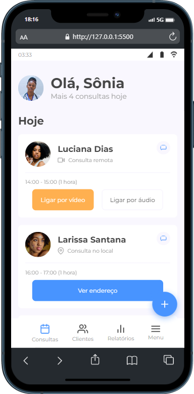
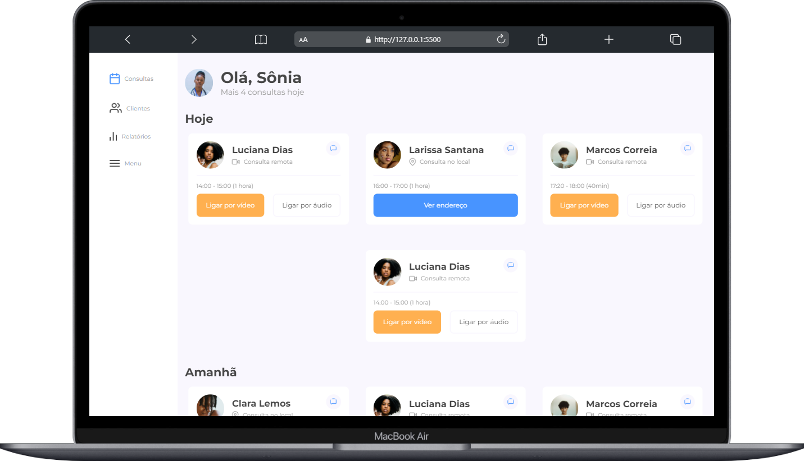

# #07daysOfCode - HTML e CSS - Responsividade 👩🏾‍💻 

&nbsp;
&nbsp;
&nbsp;
&nbsp;
&nbsp;
 

### Desafio proposto por [Natália F. da Silva e Alura](https://7daysofcode.io/matricula/responsividade) com o objetivo de colocar em prática os conhecimentos de HTML e CSS, por 7 dias.  

### Qual será o desafio?  
>**Desenvolver uma página responsiva para que os médicos de uma clínica possam ter controle sobre todas consultas agendadas, sejam elas presenciais ou remotas.**  

Acesse o protótipo do site no 
[Figma](https://www.figma.com/file/4OjHFmeHAgfX2JpRymOeA0/7days---Responsividade?node-id=0%3A1&t=er6vIK84iMmUXxvz-0).

